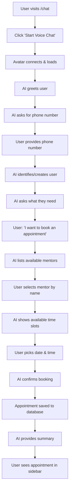
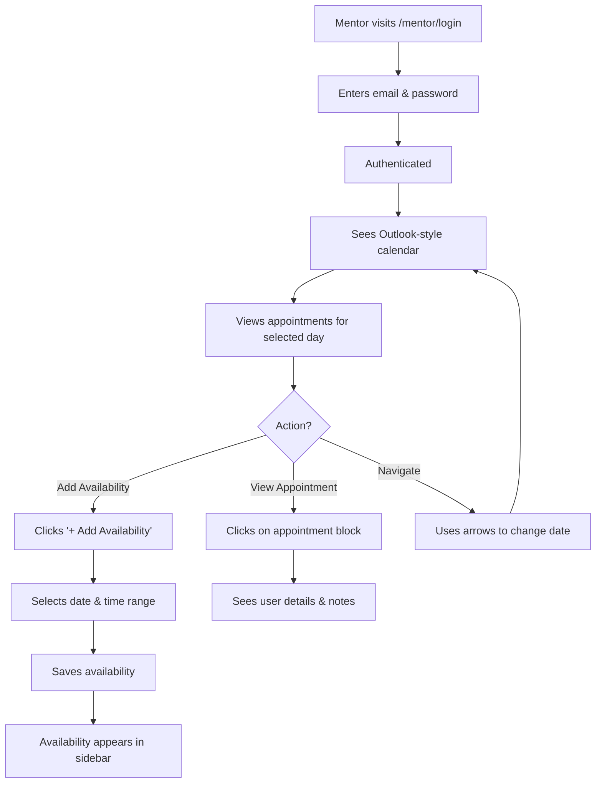
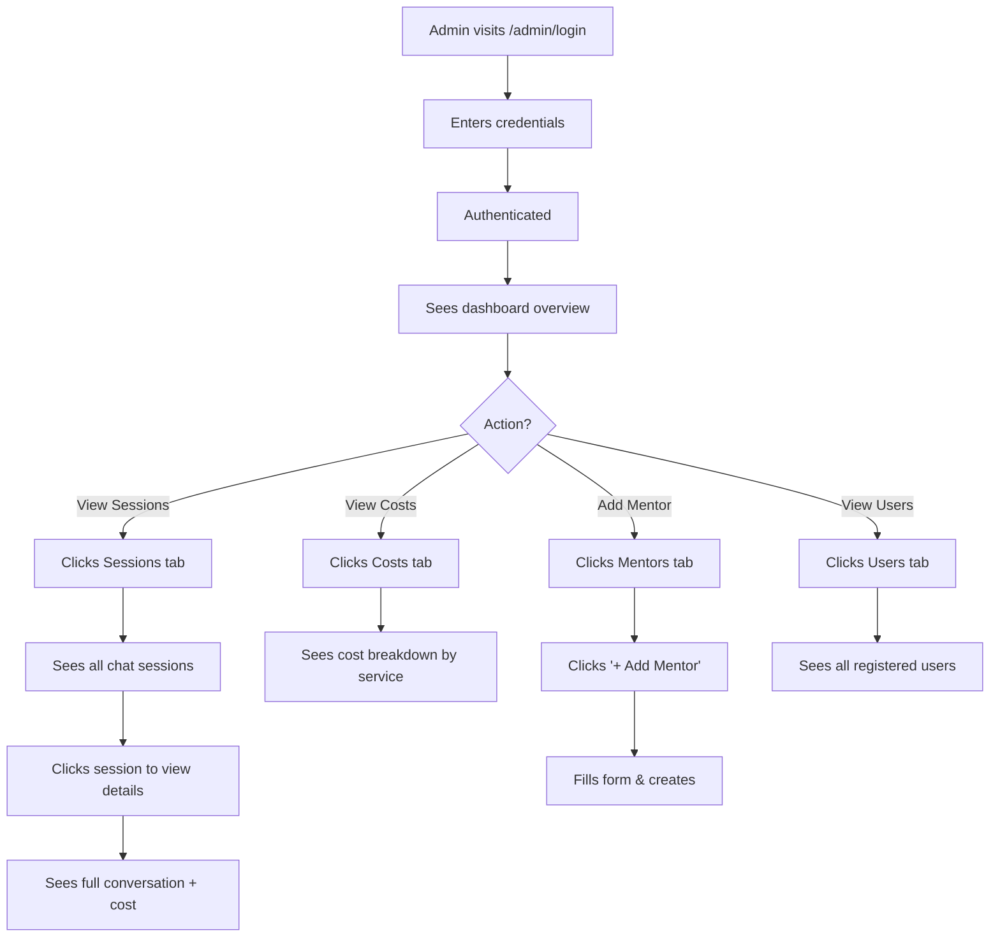

<div align="center">

# 🎙️✨ Voice Agent - AI-Powered Appointment Booking System

**A production-ready voice appointment booking platform with AI assistant, full-screen avatar, and comprehensive admin dashboard**

[](https://nextjs.org/)
[](https://livekit.io/)
[](https://python.org/)
[](https://supabase.com/)

**🚀 [Deploy on Vercel](#-vercel-deployment) | 📖 [User Flows](#-user-flows) | 🏗️ [Architecture](#-architecture)**

</div>

---

## 📋 Table of Contents

- [Overview](#-overview)
- [Features](#-features)
- [User Flows](#-user-flows)
- [Architecture](#-architecture)
- [Quick Start](#-quick-start)
- [Vercel Deployment](#-vercel-deployment)
- [Environment Variables](#-environment-variables)
- [Troubleshooting](#-troubleshooting)
- [Project Structure](#-project-structure)

---

## 🎯 Overview

Voice Agent is a complete appointment booking system that combines:
- **AI Voice Assistant** with natural conversation capabilities
- **Full-screen Beyond Presence Avatar** for visual interaction
- **Mentor Calendar Management** with Outlook-style interface
- **Admin Dashboard** with cost tracking and analytics

The system uses LiveKit Agents for real-time voice processing, OpenAI for intelligent conversation, and Supabase for data persistence.

---

## ✨ Features

### 👤 User Portal (`/chat`)
- 🎤 **Voice-based booking** - No typing required, just speak naturally
- 👤 **Full-screen AI Avatar** - Visual representation synced with speech
- 📝 **Real-time transcripts** - See what you and the AI said
- 🔧 **Tool call visualization** - Watch the AI book appointments in real-time
- 📚 **Session history** - View past conversations and appointments
- 📊 **Smart summaries** - Get a summary at the end of each call

### 👨‍⚕️ Mentor Portal (`/mentor`)
- 📅 **Outlook-style calendar** - Familiar day/week/month views
- ⏰ **Current time indicator** - Red line showing current time
- 📋 **Appointment management** - See who booked and when
- ✅ **Availability scheduling** - Add dates and time slots easily
- 📱 **Responsive design** - Works on all devices

### 👨‍💼 Admin Portal (`/admin`)
- 📊 **Dashboard analytics** - Key metrics at a glance
- 👥 **User management** - View, add, and manage users
- 👨‍⚕️ **Mentor management** - Create and manage mentors
- 💬 **Session viewer** - Full conversation history
- 💰 **Cost tracking** - Detailed cost breakdown per session (STT, TTS, LLM)
- 📈 **Usage statistics** - Track system usage and costs

---

## 🎭 User Flows

### Flow 1: User Booking an Appointment



**Key Steps:**
1. User enters `/chat` page
2. Clicks "Start Voice Chat" button
3. Waits for avatar to connect (with fun loader animation)
4. AI greets and asks for phone number
5. User provides phone number (voice-verified authentication)
6. AI loads user context (past appointments, sessions)
7. User requests appointment booking
8. AI lists mentors with specialties
9. User selects mentor
10. AI shows available slots for that mentor
11. User picks date/time
12. AI confirms and books appointment
13. Summary shown at end of conversation

### Flow 2: Mentor Managing Calendar



**Key Steps:**
1. Mentor logs in with email/password
2. Sees calendar with current time indicator (red line)
3. Views appointments as colored blocks on timeline
4. Can add availability via sidebar
5. Can navigate between days/weeks/months
6. Can see appointment details on hover/click

### Flow 3: Admin Monitoring System



**Key Steps:**
1. Admin logs in
2. Views dashboard with key metrics
3. Can view all sessions with full conversation history
4. Can see cost breakdown (STT, TTS, LLM) per session
5. Can add/manage mentors
6. Can view all users and their appointments

---

## 🏗️ Architecture

```
┌─────────────────────────────────────────────────────────────────────┐
│                         FRONTEND (Next.js)                          │
│                         Deployed on Vercel                          │
├──────────────────┬──────────────────┬──────────────────────────────┤
│    User Chat     │  Mentor Calendar │       Admin Dashboard         │
│  + LiveKit Room  │  + Availability  │  + Stats, Users, Sessions    │
│  + BEY Avatar    │  + Appointments  │  + Cost Tracking             │
│  (Full-screen)   │  (Outlook-style) │  (Analytics)                 │
└────────┬─────────┴────────┬─────────┴────────────┬─────────────────┘
         │                  │                      │
         │ WebRTC           │ REST API             │ REST API
         │ (video+audio)    │                      │
┌────────▼──────────────────▼──────────────────────▼─────────────────┐
│                         BACKEND                                      │
│                    (Separate Server/Cloud)                           │
├─────────────────────────────┬───────────────────────────────────────┤
│    LiveKit Agent (main.py)  │        FastAPI (api.py)               │
│    - Deepgram STT           │        - Auth endpoints               │
│    - OpenAI LLM + Tools     │        - User/Mentor CRUD             │
│    - Cartesia TTS           │        - Appointments                 │
│    - BEY Avatar Plugin      │        - Sessions                     │
│    - Session tracking       │        - LiveKit tokens               │
│    - Cost tracking          │        - Cost logs                    │
└────────────────┬────────────┴───────────────────┬───────────────────┘
                 │                                │
                 └────────────────┬───────────────┘
                                  │
                    ┌─────────────▼─────────────┐
                    │      Supabase Database     │
                    │  - users, mentors, admins │
                    │  - appointments            │
                    │  - sessions, messages      │
                    │  - mentor_availability        │
                    │  - cost_logs                │
                    └───────────────────────────┘
```

### Technology Stack

**Frontend:**
- Next.js 14 (React framework)
- Tailwind CSS (styling)
- LiveKit Client (WebRTC)
- Zustand (state management)

**Backend:**
- Python 3.12
- LiveKit Agents Framework
- FastAPI (REST API)
- Supabase (PostgreSQL database)

**AI Services:**
- Deepgram (Speech-to-Text)
- Cartesia (Text-to-Speech)
- OpenAI GPT-4o-mini (LLM)
- Beyond Presence (Avatar)

**Infrastructure:**
- Vercel (Frontend hosting)
- LiveKit Cloud (WebRTC infrastructure)
- Supabase Cloud (Database)

---

## 🚀 Quick Start

### Prerequisites

- Node.js 18+ and npm
- Python 3.12+
- Supabase account
- LiveKit Cloud account
- API keys for: Deepgram, Cartesia, OpenAI, Beyond Presence

### 1. Database Setup

1. Create a Supabase project at [supabase.com](https://supabase.com)
2. Copy your project URL and anon key
3. **Automatic Setup**: Add `SUPABASE_DB_PASSWORD` to `.env` - tables will be created automatically!
4. **Manual Setup**: Run `backend/schema.sql` in the SQL Editor

### 2. Backend Setup

```bash
# Clone the repository
git clone <your-repo-url>
cd Voice-Agent

# Create .env file in project root
cat > .env << EOF
# LiveKit
LIVEKIT_URL=wss://your-project.livekit.cloud
LIVEKIT_API_KEY=your-api-key
LIVEKIT_API_SECRET=your-api-secret

# AI Services
DEEPGRAM_API_KEY=your-deepgram-key
CARTESIA_API_KEY=your-cartesia-key
CARTESIA_VOICE_ID=a0e99841-438c-4a64-b679-ae501e7d6091
OPENAI_API_KEY=your-openai-key
OPENAI_MODEL=gpt-4o-mini

# Beyond Presence Avatar
BEY_API_KEY=your-beyond-presence-api-key
BEY_AVATAR_ID=1c7a7291-ee28-4800-8f34-acfbfc2d07c0

# Supabase
SUPABASE_URL=https://your-project.supabase.co
SUPABASE_KEY=your-supabase-anon-key
SUPABASE_DB_PASSWORD=your-db-password

# Auth
JWT_SECRET=your-jwt-secret-change-this
EOF

# Create virtual environment
python3 -m venv .venv
source .venv/bin/activate  # On Windows: .venv\Scripts\activate

# Install dependencies
pip install -r requirements.txt

# Start API server (in one terminal)
cd backend && python api.py

# Start voice agent (in another terminal)
cd backend && python main.py start
```

### 3. Frontend Setup

```bash
cd frontend

# Create .env.local
cat > .env.local << EOF
NEXT_PUBLIC_API_URL=http://localhost:8000
NEXT_PUBLIC_LIVEKIT_URL=wss://your-project.livekit.cloud
EOF

# Install dependencies
npm install

# Start dev server
npm run dev
```

### 4. Access

- **User Portal**: http://localhost:3000/chat
- **Mentor Portal**: http://localhost:3000/mentor/login
- **Admin Portal**: http://localhost:3000/admin/login

**Default Credentials:**
- Mentor: `sarah@example.com` / `mentor123`
- Admin: `admin@superbryn.com` / `admin123`

---

## ☁️ Vercel Deployment

### Frontend Deployment

1. **Push to GitHub**
   ```bash
   git init
   git add .
   git commit -m "Initial commit"
   git remote add origin <your-github-repo>
   git push -u origin main
   ```

2. **Import to Vercel**
   - Go to [vercel.com](https://vercel.com)
   - Click "New Project"
   - Import your GitHub repository
   - Set root directory to `frontend`

3. **Configure Environment Variables**
   In Vercel project settings, add:
   ```
   NEXT_PUBLIC_API_URL=https://your-backend-api.com
   NEXT_PUBLIC_LIVEKIT_URL=wss://your-project.livekit.cloud
   ```

4. **Deploy**
   - Vercel will automatically detect Next.js
   - Click "Deploy"
   - Your app will be live at `https://your-project.vercel.app`

### Backend Deployment

The backend needs to run on a separate server (not Vercel, as it's a long-running process). Options:

**Option 1: Railway**
```bash
# Install Railway CLI
npm i -g @railway/cli

# Login
railway login

# Initialize project
railway init

# Add environment variables
railway variables set LIVEKIT_URL=wss://...
railway variables set DEEPGRAM_API_KEY=...
# ... (add all env vars)

# Deploy
railway up
```

**Option 2: Render**
1. Create a new Web Service
2. Connect your GitHub repo
3. Set build command: `pip install -r requirements.txt`
4. Set start command: `cd backend && python api.py`
5. Add all environment variables
6. Deploy

**Option 3: DigitalOcean App Platform**
1. Create new app from GitHub
2. Add Python service
3. Configure environment variables
4. Deploy

**Option 4: AWS/GCP/Azure**
- Use EC2/Compute Engine/Virtual Machines
- Or use container services (ECS, Cloud Run, Container Instances)

### LiveKit Agent Deployment

The LiveKit agent (`main.py`) needs to run continuously. Deploy it alongside your backend:

```bash
# On your server
cd backend
python main.py start
```

Or use a process manager:
```bash
# Using PM2
npm install -g pm2
pm2 start backend/main.py --name voice-agent --interpreter python3
pm2 save
pm2 startup
```

---

## 🔐 Environment Variables

### Frontend (`.env.local`)

```env
NEXT_PUBLIC_API_URL=http://localhost:8000
NEXT_PUBLIC_LIVEKIT_URL=wss://your-project.livekit.cloud
```

### Backend (`.env`)

```env
# LiveKit
LIVEKIT_URL=wss://your-project.livekit.cloud
LIVEKIT_API_KEY=your-api-key
LIVEKIT_API_SECRET=your-api-secret

# AI Services
DEEPGRAM_API_KEY=your-deepgram-key
CARTESIA_API_KEY=your-cartesia-key
CARTESIA_VOICE_ID=a0e99841-438c-4a64-b679-ae501e7d6091
OPENAI_API_KEY=your-openai-key
OPENAI_MODEL=gpt-4o-mini

# Beyond Presence Avatar
BEY_API_KEY=your-beyond-presence-api-key
BEY_AVATAR_ID=1c7a7291-ee28-4800-8f34-acfbfc2d07c0

# Supabase
SUPABASE_URL=https://your-project.supabase.co
SUPABASE_KEY=your-supabase-anon-key
SUPABASE_DB_PASSWORD=your-db-password

# Auth
JWT_SECRET=your-jwt-secret-change-this
```

---

## 🎭 Beyond Presence Avatar

The avatar is integrated using the **LiveKit BEY plugin**, not a frontend SDK. This means:

1. The avatar runs on the backend as a LiveKit participant
2. Video is streamed to the frontend via WebRTC
3. The avatar automatically syncs with TTS audio
4. Full-screen display with smooth video

**Setup:**
1. Get your API key from [app.bey.chat](https://app.bey.chat)
2. Get your avatar ID from [app.bey.chat/avatars](https://app.bey.chat/avatars)
3. Add to `.env`:
   ```
   BEY_API_KEY=your-api-key
   BEY_AVATAR_ID=1c7a7291-ee28-4800-8f34-acfbfc2d07c0
   ```

Reference: [LiveKit BEY Plugin Docs](https://docs.livekit.io/agents/models/avatar/plugins/bey/)

---

## 🔧 Troubleshooting

### Avatar Not Showing
- Verify `BEY_API_KEY` is set in `.env`
- Check agent logs for "Avatar started successfully" or error messages
- Ensure `BEY_AVATAR_ID` is a valid avatar from your account
- Check browser console for WebRTC connection errors

### Database Errors
- The backend automatically falls back to in-memory storage
- Run `backend/schema.sql` in Supabase SQL Editor to create tables
- Verify `SUPABASE_URL` and `SUPABASE_KEY` are correct
- Check Supabase project is active

### LiveKit Connection Issues
- Verify `LIVEKIT_URL`, `LIVEKIT_API_KEY`, and `LIVEKIT_API_SECRET` in `.env`
- Check that `NEXT_PUBLIC_LIVEKIT_URL` matches in frontend `.env.local`
- Ensure microphone permissions are granted in browser
- Check LiveKit Cloud dashboard for connection status

### Cost Tracking Shows $0
- Check backend logs for metrics collection messages
- Verify `metrics_collected` events are firing
- Ensure UsageCollector is properly initialized
- Check `cost_logs` table in Supabase for entries

### 401 Unauthorized Errors
- User endpoints now work without tokens (voice-verified users)
- Mentor/Admin endpoints require JWT tokens
- Check token expiration (24 hours default)
- Verify JWT_SECRET matches between backend instances

---

## 📁 Project Structure

```
Voice-Agent/
├── backend/
│   ├── main.py          # LiveKit voice agent with BEY avatar
│   ├── api.py           # FastAPI REST endpoints
│   ├── db.py            # Database operations (with fallback)
│   └── schema.sql       # Supabase schema
├── frontend/
│   ├── src/
│   │   ├── app/
│   │   │   ├── page.tsx           # Redirect to /chat
│   │   │   ├── chat/page.tsx      # Full-screen avatar chat
│   │   │   ├── mentor/            # Mentor dashboard
│   │   │   │   ├── login/page.tsx
│   │   │   │   └── page.tsx
│   │   │   └── admin/             # Admin dashboard
│   │   │       ├── login/page.tsx
│   │   │       └── page.tsx
│   │   ├── components/
│   │   │   ├── LiveKitRoom.tsx    # LiveKit + avatar video
│   │   │   └── CallingLoader.tsx  # Loading animation
│   │   └── lib/
│   │       ├── api.ts             # API client
│   │       └── store.ts           # Zustand stores
│   ├── public/                    # Static assets
│   ├── .env.local                 # Frontend env vars
│   ├── next.config.js
│   └── package.json
├── .env                            # Backend env vars
├── requirements.txt
├── pyproject.toml
└── README.md
```

---

## 📝 License

MIT License - feel free to use this project for your own purposes!

---

<div align="center">

**Built with ❤️ using LiveKit, Next.js, and OpenAI**

[Report Bug](https://github.com/your-repo/issues) · [Request Feature](https://github.com/your-repo/issues) · [Documentation](https://docs.livekit.io/)

</div>
